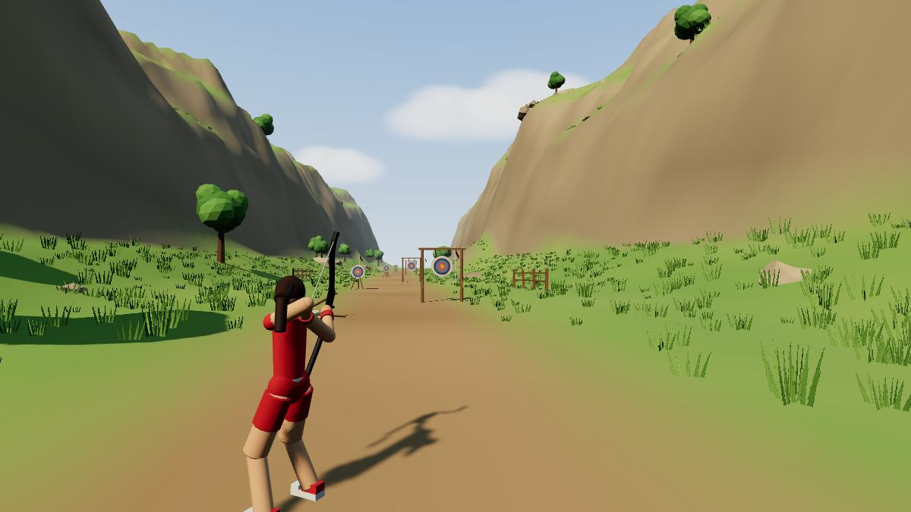

# Arco & Flecha — simulação balística

Jogo 3D de arco e flecha em **Three.js** com física em **Rapier3D**. Roda no
navegador, sem assets externos: cenário, personagem e alvos são gerados por
código.

O diferencial não é o visual — é que **nada da trajetória é simulado "de
mentira"**. A flecha é um corpo rígido com massa, inércia e momento angular; o
que ela faz no ar sai de gravidade, arrasto e vento; o que acontece no impacto
sai do solver de contato. Não existe interpolação, curva pré-calculada,
correção de rota nem assistência de mira.



## Rodar

```bash
npm install
```

```bash
npm run dev
```

Abre em `http://localhost:5173`. Para gerar a versão estática:

```bash
npm run build
```

O `dist/` resultante é autocontido (o WASM do Rapier vem embutido). Em produção
o servidor Node (`npm start`) serve o `dist/` **e** o WebSocket multiplayer na
mesma porta.

## Deploy no EasyPanel

O repositório já traz um `Dockerfile` multi-stage pronto para o EasyPanel
(porta **3000**, healthcheck em `/healthz`, HTTPS + WSS pelo Traefik).

Guia completo, do VPS até jogar online:

→ **[docs/easypanel.md](docs/easypanel.md)**

Resumo: App service → Source GitHub → Builder **Dockerfile** → Domain na
porta **3000** → **Deploy** → abrir o domínio e entrar na sala.

### Trancar a sala (`ROOM_KEY`)

Domínio público é domínio que robô acha. Definindo `ROOM_KEY` no Environment do
EasyPanel, a página segue aberta mas **a sala só aceita quem chega pelo link do
convite**:

```text
https://SEU_DOMINIO/?k=SUA_CHAVE
```

O navegador lembra a chave depois da primeira entrada, então voltar pelo
favorito, dar F5 ou reconectar no meio da partida continua funcionando sem o
`?k=`. `ROOM_KEY` vazia (o padrão, e o caso do `npm run dev`) deixa a sala
aberta. Detalhes e troca de chave sem derrubar ninguém: [docs/easypanel.md](docs/easypanel.md#7-ambiente-environment).

## Controles

| Comando | Ação |
|---|---|
| **Mouse** | mirar (clique na tela para começar; `Esc` sai) |
| **Botão esquerdo** | segurar tensiona o arco, soltar dispara |
| **E** | golpeia com a faca usando a mão livre (0,5 s) |
| **Clique** (durante o voo) | encerra a câmera da flecha e volta para a arqueira |
| **Botão direito** / **C** | alterna primeira e terceira pessoa |
| **W A S D** | andar · **Shift** correr |
| **Tab** | selecionar o próximo alvo |
| **T** | liga/desliga os traçados (ligados por padrão) |
| **R** | limpar as flechas cravadas |
| **~** | painel de depuração |
| **H** | ocultar a ajuda |

Todo disparo joga a câmera para trás da flecha automaticamente; um clique
devolve a visão para a arqueira (esse clique não tensiona o arco, para não
soltar um tiro fraco sem querer).

Em **primeira pessoa** a câmera fica no olho da arqueira, logo acima da
ancoragem da corda: a flecha passa rente ao rosto e o arco aparece à direita do
quadro, como quem realmente mira.

Segurar o arco tensionado por mais de 3 s começa a tremer a mira, e o tremor
cresce com o tempo — vale soltar e reengatar.

## A física

Tudo em SI, com 1 unidade Three.js = 1 metro. Todas as constantes moram em
[`src/config.js`](src/config.js).

| Grandeza | Valor | Efeito no jogo |
|---|---|---|
| Gravidade | −9,81 m/s² | a queda que o jogador precisa compensar |
| Passo da física | 1/120 s, fixo | resultado idêntico em 60, 120 ou 144 Hz |
| Massa da flecha | 25 g | define o momento transferido ao alvo |
| Comprimento / diâmetro | 0,75 m / 8 mm | área frontal do arrasto = 5,03·10⁻⁵ m² |
| Coeficiente de arrasto | 2,0 | ~20 % de perda de velocidade em 100 m |
| Área lateral efetiva | 55× a frontal | penaliza voar de lado; é o que estabiliza |
| Centro de pressão | 13 cm atrás do CM | gera o torque que alinha a ponta |
| Velocidade inicial | 30 → 85 m/s | curva saturando em 1,2 s de tensionamento |
| Densidade do ar | 1,225 kg/m³ | nível do mar, 15 °C |
| Vento | 0–12 m/s, com rajadas | entra pela velocidade relativa ao ar |

### Quatro decisões que fazem a diferença

**1. O arrasto é calculado à mão.** Nenhuma engine de física traz arrasto
aerodinâmico. O `linearDamping` do Rapier é amortecimento exponencial — modelo
diferente, que erraria a queda. A cada passo fixo aplicamos:

```
F_arrasto = −½ · ρ · Cd · A_ef · |v_rel| · v_rel
```

com `v_rel = v_flecha − v_vento`. O vento nunca é uma força separada: ele altera
a velocidade relativa ao ar, e é por isso que o efeito dele depende da
velocidade da flecha e do tempo de voo. Um tiro fraco a 100 m sofre muito mais
deriva que um tiro forte.

**2. A flecha se alinha sozinha, por aerodinâmica real.** A ponta não é girada
à força para o vetor velocidade. O arrasto é aplicado no **centro de pressão**,
13 cm atrás do centro de massa, e a área efetiva cresce com o ângulo de ataque
(`A_ef = A · (1 + 55·sen²α)`). O torque resultante endireita a flecha com o
pequeno atraso e a oscilação amortecida de uma empena de verdade. Medido em voo,
o ângulo de ataque fica entre 0,4° e 3,4° do lançamento ao pouso, inclusive
passando pelo apogeu de um tiro alto.

**3. CCD ligado.** A 85 m/s a flecha percorre 71 cm por passo de física. Sem
detecção contínua de colisão ela atravessaria alvos finos de forma aleatória — e
isso costuma ser diagnosticado como bug de colisão quando é passo de integração.

**4. O impulso é lido antes do contato.** Depois que o solver resolve a colisão a
velocidade da flecha já mudou. Guardamos a velocidade do passo anterior e é ela
que vira `J = m·v`, aplicada no ponto exato do contato (lido do manifold do
narrow-phase, nunca estimado pelo centro de massa — numa flecha de 75 cm o erro
seria de dezenas de centímetros).

### Os alvos

As massas não são arbitrárias. Uma flecha de 25 g a 70 m/s carrega 1,75 kg·m/s;
fazendo a conta de energia contra a elevação do centro de gravidade, **só tomba
quem pesa menos de ~3 kg**. Então:

- **leve (2,5 kg, tripé)** — tomba com um impacto forte e centrado; resiste a
  tiro fraco ou baixo. O tombo é consequência da conta, não um efeito roteirizado.
- **suspenso (5 kg, junta revoluta)** — balança como pêndulo, com as flechas
  cravadas indo junto.
- **pesado (70 kg)** — absorve e mal se mexe.

A flecha cravada em alvo dinâmico continua sendo um corpo dinâmico, presa por um
`FixedJoint` que preserva a orientação exata do impacto. Congelá-la travaria o
alvo junto. Já no cenário estático (chão, rochas, árvores) congelar é mais
estável e mais barato que um vínculo.

A pontuação sai da posição do impacto convertida para o referencial do alvo, o
que mantém os anéis corretos mesmo com o alvo tombado ou balançando.

## Mira

O retículo é fixo no centro da tela e a flecha sai apontada exatamente para o
ponto do cenário que está sob ele. Para achar esse ponto, um raio é lançado pela
engine de física a partir da câmera; o primeiro colisor atingido define a
distância de convergência, e a linha de tiro é traçada do arco até lá.

Isso existe porque a câmera e o arco não ocupam o mesmo lugar no espaço. Uma
direção de tiro paralela ao eixo da câmera erraria o que está sob a mira por um
deslocamento fixo — em terceira pessoa, mais de um metro. A convergência corrige
**apenas essa diferença geométrica**:

- ✅ elimina o paralaxe entre câmera e flecha;
- ❌ não compensa gravidade;
- ❌ não compensa vento;
- ❌ não procura alvos, não gruda, não corrige o disparo.

Ou seja: mirar no alvo acerta **em linha reta**. A flecha ainda cai e ainda
deriva. Verificado com gravidade, arrasto e vento desligados: os sete alvos, de
10 a 100 m, foram acertados na mosca só apontando o retículo para eles.

O raycast é usado só para MIRAR. O acerto continua sendo detectado por contato da
engine de física, nunca por raio.

## Traçados

Cada flecha desenha o caminho que realmente percorreu — os pontos são amostrados
da posição do corpo rígido a 120 Hz durante o voo, não de uma curva prevista. Por
isso o traçado mostra o efeito do arrasto e do vento, e não uma parábola ideal.

Os traçados de tiros anteriores ficam na cena para comparação: **15 s totalmente
visíveis** depois que a flecha para, e então **5 s desaparecendo gradualmente**.
São desenhados com `Line2` porque `linewidth` de `LineBasicMaterial` é ignorado
na maioria das plataformas — uma linha de 1 px some contra o cenário.

## Critérios de aceite

Abra o painel com `~` e clique em **rodar auto-teste**. Ele monta um mundo
Rapier temporário — mesma gravidade, mesmo passo fixo, mesma massa, mesma conta
de arrasto — e verifica:

| Teste | Resultado |
|---|---|
| Alcance sem arrasto, 60 m/s a 45° vs `v₀²·sen(2θ)/g` | **366,9 m vs 367,0 m — erro 0,03 %** |
| Arrasto reduz o alcance e a velocidade decresce | **224,1 m (−39 %), monotônica** |
| CCD a 85 m/s contra placa de 5 cm, 50 disparos | **50/50 detectadas, 0 atravessaram** |

Medições complementares no jogo: velocidade de impacto de 82,7 m/s a 10 m e
66,5 m/s a 100 m (perda de ~22 %, na faixa de uma flecha real); 30 flechas
cravadas + 7 alvos custam ~1,5 ms de CPU por frame.

O painel também traz vetores de velocidade / arrasto / vento no mundo, telemetria
de voo e sliders para massa, Cd, velocidade máxima, gravidade, vento e posição do
centro de pressão. Os sliders valem para as **próximas** flechas — massa e
inércia são fixadas na criação do corpo.

## Estrutura

```
src/
  main.js              laço principal, acumulador de passo fixo
  config.js            todas as constantes físicas, com unidade
  core/
    physics.js         mundo Rapier, eventos de contato (não importa Three.js)
    sync.js            única ponte física → visual, com interpolação
    renderer.js        WebGL, câmera, luzes PBR, céu e nuvens
  entities/
    environment.js     relevo, colisor trimesh, rochas, árvores, vegetação
    player.js          arqueira, postura por IK de dois ossos
    bow.js             arco recurvo, corda e lâminas animadas
    arrow.js           aerodinâmica, impacto, flechas cravadas
    target.js          alvos, vínculos, pontuação por anéis
  systems/
    wind.js            vento contínuo com rajadas
    aim.js             linha de tiro e projeção do pino
    camera.js          terceira pessoa + câmera da flecha
    input.js           mouse com pointer lock e teclado
    selftest.js        critérios de aceite em mundo isolado
  ui/
    hud.js             placar, vento, força, retículo
    debug.js           telemetria, vetores, sliders, auto-teste
  utils/
    math.js            IK de dois ossos, interpolação, PRNG
    noise.js           ruído de valor + FBM (terreno e vento)
    geometry.js        segmentos que se esticam entre dois pontos
```

O relevo alimenta o render **e** o colisor com a mesma geometria, então não
existe descolamento entre o que se vê e o que a física enxerga. `core/physics.js`
não conhece Three.js; a sincronização acontece num único lugar.

## Notas de implementação

- **Interpolação de render.** O passo é fixo em 1/120 s num acumulador. Guardamos
  a transformação anterior e a atual de cada corpo e interpolamos por `alpha` na
  hora de desenhar — sem isso a imagem treme em qualquer taxa de quadros que não
  seja múltipla de 120.
- **Torque acumulado.** No Rapier, forças **e torques** somam entre passos até
  serem zerados. `addForceAtPoint` alimenta os dois acumuladores, então
  `resetForces()` sozinho deixa o torque crescendo indefinidamente e a flecha
  acaba voando de traseira. É preciso `resetTorques()` também.
- **Não mexa no mundo durante a drenagem de eventos.** Tratar um impacto cria
  vínculos e remove corpos; fazer isso dentro do callback de
  `drainCollisionEvents` invalida os handles dos eventos seguintes e o Rapier
  entra em pânico (`unreachable`) no passo seguinte. Os contatos são
  bufferizados e só despachados depois que a fila termina.
- **Postura de arqueiro nasce da ancoragem, não do ombro.** A corda é puxada até
  um ponto fixo do rosto, do lado da mão que puxa, e o arco fica onde a linha da
  flecha manda. Derivar o punho a partir do ombro joga o nock para o lado errado
  do rosto e o braço da corda atravessa o tronco. A âncora também precisa ser
  medida no espaço do personagem, não no do tronco: o giro de 66° da postura
  converte "esquerda" em "para trás" e centraliza a âncora no corpo.
- **Orientação dos triângulos do terreno.** Como z diminui conforme o índice da
  linha cresce, a ordem ingênua de índices gera faces viradas para baixo e o chão
  some por backface culling.
- **Mundo determinístico.** Terreno, vegetação e posicionamento usam PRNG com
  semente fixa: o vale é sempre o mesmo entre sessões.
- **Depuração.** `window.game` está exposto no console para inspecionar
  `player`, `arrows`, `targets`, `wind` e o mundo de física em tempo real.

## Limites conhecidos

- Sem áudio (o projeto não usa nenhum arquivo externo).
- A arqueira não tem ciclo de caminhada completo — anda com balanço e postura de
  tiro mantida.
- O arrasto usa Cd constante; não há modelo de número de Reynolds nem de efeito
  Magnus (a flecha não tem rotação axial imposta pela empena).
